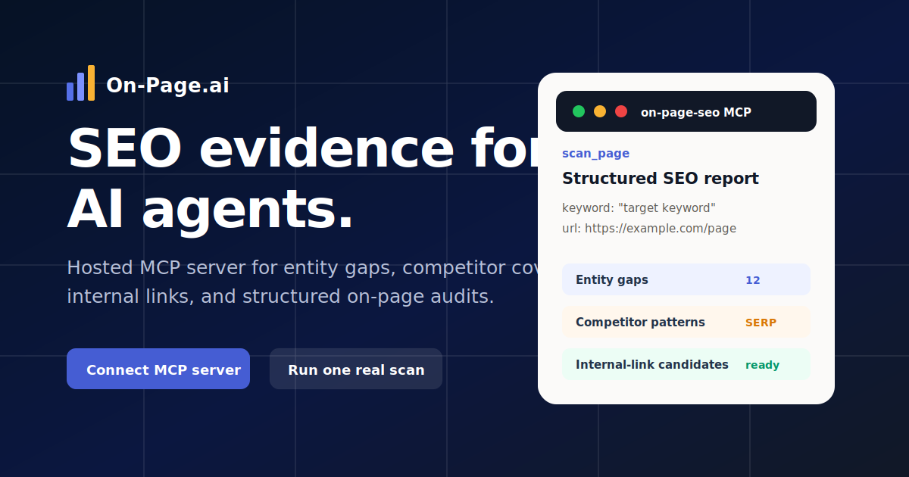
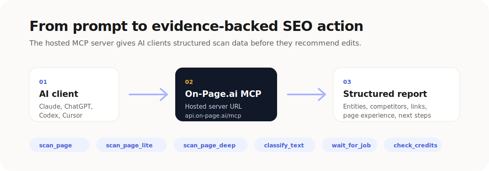
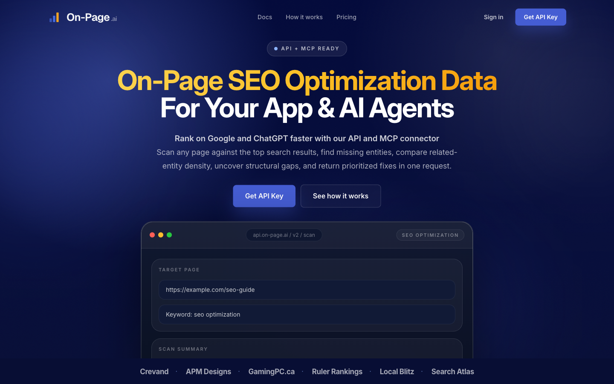

# On-Page.ai SEO MCP



Hosted MCP server for evidence-backed on-page SEO audits, entity-gap analysis,
competitor coverage checks, internal-link opportunities, and page-experience
benchmarks.

This repository is intentionally public and docs-only. The production MCP server
is hosted by On-Page.ai; no private server source, deployment notes, customer
data, credentials, or internal runbooks belong here.

## Demo

https://github.com/on-page-ai/on-page-seo-mcp/raw/main/assets/how-it-works-demo.mp4

## Server

```text
https://api.on-page.ai/mcp
```

- Transport: Streamable HTTP
- Authentication: OAuth where supported, API key bearer token for manual clients
- Required OAuth scope: `mcp:seo`
- Public docs: <https://api.on-page.ai/mcp/docs>
- Install page: <https://api.on-page.ai/install>

## What It Does



On-Page.ai gives AI agents structured SEO evidence before they recommend edits.
Instead of generic SEO advice, the agent can scan the live URL and compare it
against the current search-result cohort for a keyword.

Core workflows:

- Find missing entities and related terms
- Compare competitor topic coverage
- Generate internal-link candidates
- Benchmark page experience against top ranking competitors
- Classify page or text topical focus
- Return customer-safe structured reports for agent reasoning

## API Homepage

[](https://api.on-page.ai/)

The public API homepage shows the product surface behind the hosted MCP server.

## Available Tools

| Tool | Use |
| --- | --- |
| `scan_page` | Default full SEO audit for URL + keyword recommendations |
| `scan_page_lite` | Faster entity and competitor-cohort scan |
| `scan_page_deep` | Deeper competitor analysis and optional page-experience benchmark |
| `classify_text` | Categorize a URL or text into topical buckets |
| `check_job` | Check async job status |
| `wait_for_job` | Wait for async job completion |
| `get_job_result` | Fetch a completed job result |
| `check_credits` | Check available credits and route costs |

## Quick Install

Most users should start here:

<https://api.on-page.ai/install>

Client-specific docs are also included in [`docs/install.md`](docs/install.md).

## Example Prompts

```text
Use On-Page.ai to scan https://example.com/page for "target keyword".
Return the top missing entities, explain why they matter, and suggest minimal
edits to existing sentences.
```

```text
Run a deep On-Page.ai scan for https://example.com/page with keyword
"target keyword". Compare the recurring competitor gaps and prioritize the
fixes that are most likely to improve relevance.
```

More examples: [`examples/prompts.md`](examples/prompts.md)

## Directory Submission Assets

MCP directory metadata lives in:

- [`metadata/directory-submission.json`](metadata/directory-submission.json)
- [`docs/directory-listing.md`](docs/directory-listing.md)

## Safety Boundary

This repo should only contain public-facing material. If you are contributing,
read [`SECURITY.md`](SECURITY.md) and do not include:

- private source code
- environment files
- deployment notes
- credentials or tokens
- customer data
- internal admin URLs
- internal review packages
- generated debug output

## Support

- Docs: <https://api.on-page.ai/docs>
- MCP docs: <https://api.on-page.ai/mcp/docs>
- Contact: <team@on-page.ai>
